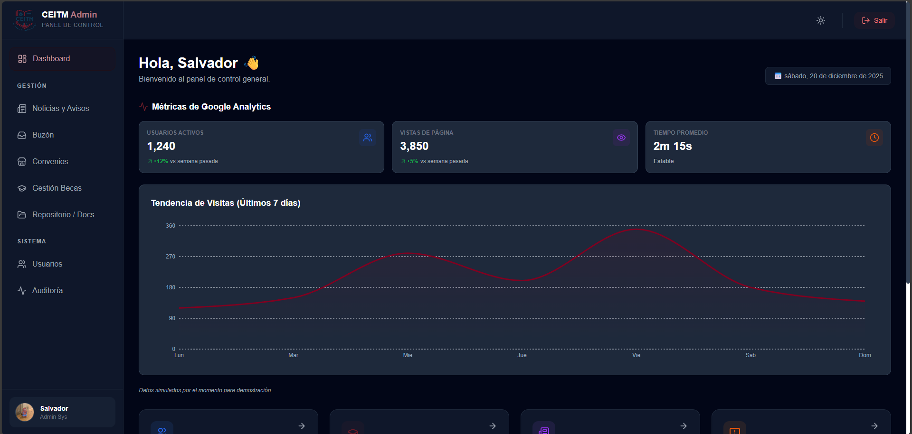
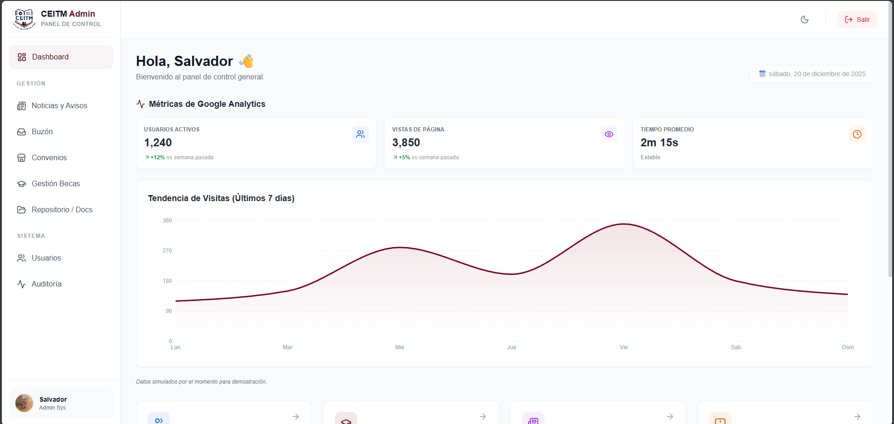
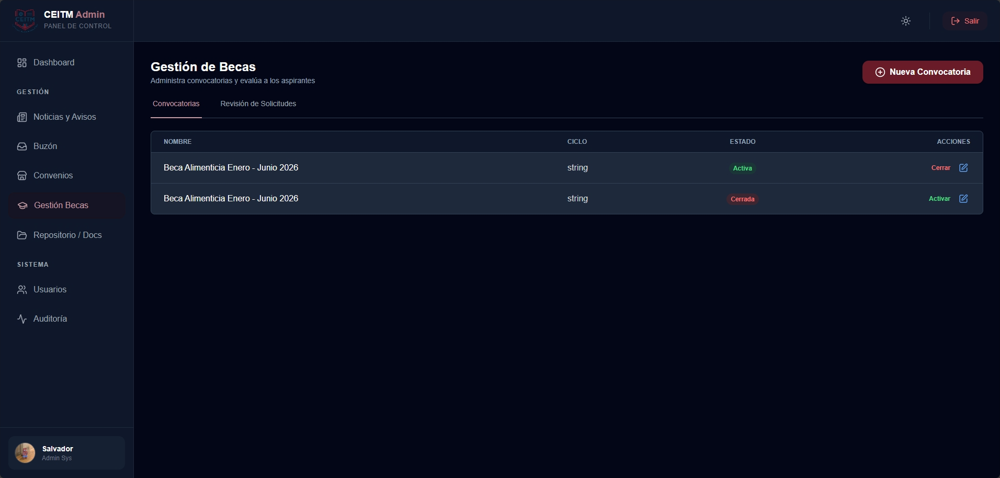
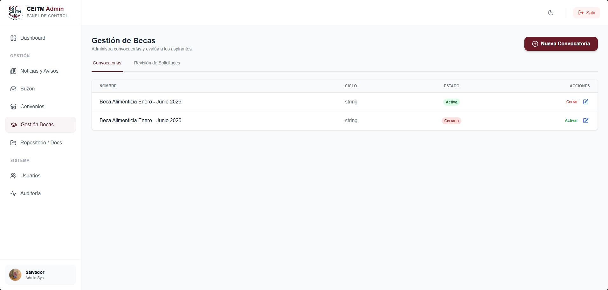
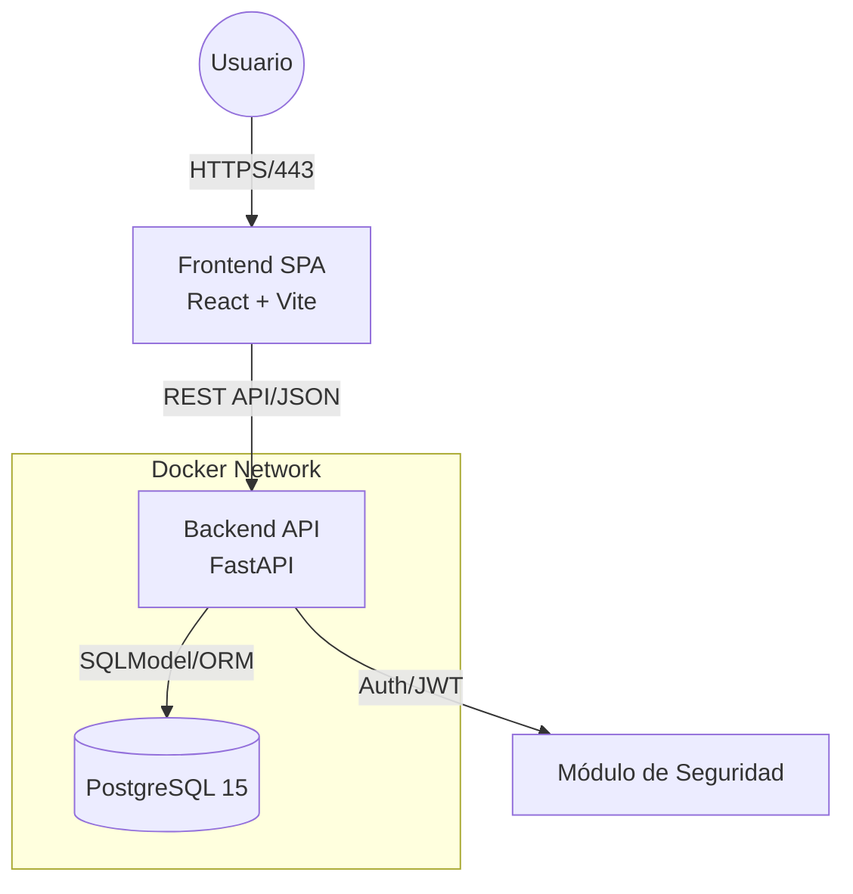

# 🏛️ Plataforma CEITM - Sistema de Gobernanza Digital

<div align="center">


<br/>


</div>

> **Gestión integral, transparente y escalable para el H. Consejo Estudiantil del Instituto Tecnológico de Morelia.**

Esta plataforma implementa una arquitectura moderna de microservicios contenerizados para digitalizar los procesos críticos del CEITM, incluyendo la gestión de becas, convenios empresariales, auditoría de transparencia y difusión de noticias, en estricto cumplimiento con los **Estatutos Oficiales 2025**.


---

## 📸 Demo de la Interfaz

> Vista del Panel de Administración y Gestión de Becas.






---

## 🏗️ Arquitectura del Sistema

El sistema utiliza el patrón **PERF** (Postgres, Express/FastAPI, React, FastAPI) desacoplado, garantizando alta disponibilidad y separación de responsabilidades.



---

## 📋 Tabla de Contenidos

- [🏛️ Plataforma CEITM - Sistema de Gobernanza Digital](#️-plataforma-ceitm---sistema-de-gobernanza-digital)
  - [🏗️ Arquitectura del Sistema](#️-arquitectura-del-sistema)
  - [📋 Tabla de Contenidos](#-tabla-de-contenidos)
  - [🔌 Prerrequisitos del Entorno](#-prerrequisitos-del-entorno)
  - [🚀 Instalación y Despliegue](#-instalación-y-despliegue)
    - [1. Clonado y Configuración de Entorno](#1-clonado-y-configuración-de-entorno)
    - [2. Despliegue con Docker (Método Recomendado)](#2-despliegue-con-docker-método-recomendado)
    - [3. Ejecución del Frontend (Desarrollo Local)](#3-ejecución-del-frontend-desarrollo-local)
  - [🛠️ Stack Tecnológico](#️-stack-tecnológico)
    - [Frontend (SPA)](#frontend-spa)
    - [Backend (REST API)](#backend-rest-api)
  - [📂 Estructura del Proyecto](#-estructura-del-proyecto)
  - [🔧 Troubleshooting](#-troubleshooting)
    - [🤝 Contribución y Flujo de Trabajo](#-contribución-y-flujo-de-trabajo)


---

## 🔌 Prerrequisitos del Entorno

Para garantizar la ejecución correcta de los contenedores y el entorno de desarrollo local, asegúrese de cumplir con las siguientes dependencias base.

| Componente | Versión Mínima | Motivo Crítico / Nota Técnica |
| --- | --- | --- |
| **Docker Engine** | `24.0+` | Requerido para la orquestación de servicios y volúmenes persistentes. |
| **Docker Compose** | `v2.20+` | Necesario para interpretar la sintaxis `version: '3.8'` del manifiesto. |
| **Node.js** | `v18.17+ (LTS)` | Requerido por el Frontend si se ejecuta fuera de Docker (Vite build target). |
| **Python** | `3.10+` | Solo necesario para desarrollo backend local sin contenedores (Type hinting). |
| **Git** | `2.30+` | Control de versiones y gestión de submódulos (si aplica). |

---

## 🚀 Instalación y Despliegue

### 1. Clonado y Configuración de Entorno

El sistema utiliza variables de entorno para la configuración de seguridad y conexión a base de datos. **Nunca** suba el archivo `.env` al repositorio.

```bash
# 1. Clonar repositorio
git clone <URL_DEL_REPO>
cd ceitm-platform

# 2. Configurar variables de entorno
cp .env.example .env

# 3. (Opcional) Editar credenciales de BD y SECRET_KEY
vim .env

```

### 2. Despliegue con Docker (Método Recomendado)

Este comando aprovisiona la base de datos PostgreSQL y el servidor API Uvicorn en una red aislada.

```bash
docker-compose up --build -d

```

> **Verificación:** Ejecute `docker-compose ps` para asegurar que los servicios `db` y `backend` tienen estado `Up`.

### 3. Ejecución del Frontend (Desarrollo Local)

Para habilitar HMR (Hot Module Replacement) y depuración en tiempo real:

```bash
cd frontend

# Instalación limpia de dependencias (según package-lock.json)
npm install

# Iniciar servidor de desarrollo
npm run dev

```

| Servicio | URL Local | Descripción |
| --- | --- | --- |
| **Frontend App** | `http://localhost:5173` | Interfaz de Usuario (Vite Dev Server) |
| **Backend API** | `http://localhost:8000` | API Root |
| **API Docs** | `http://localhost:8000/docs` | Documentación interactiva Swagger UI |
| **Redoc** | `http://localhost:8000/redoc` | Documentación alternativa de API |

---

## 🛠️ Stack Tecnológico

La plataforma está construida sobre tecnologías de "Bleeding Edge" para maximizar rendimiento y mantenibilidad.

### Frontend (SPA)

| Tecnología | Propósito | Referencia en Código |
| --- | --- | --- |
| **React 18** | Biblioteca UI base | `package.json` |
| **TypeScript** | Tipado estático estricto | `tsconfig.json` |
| **Vite** | Build tool de próxima generación | `vite.config.ts` |
| **Tailwind CSS** | Framework de estilos Utility-first | `tailwind.config.js` |
| **Zustand** | Gestión de estado global ligero | `store/authStore.ts` |
| **Recharts** | Visualización de datos y analíticas | `components/AnalyticsWidget.tsx` |
| **React-GA4** | Analítica web (Google Analytics 4) | `package.json` |

### Backend (REST API)

| Tecnología | Propósito | Referencia en Código |
| --- | --- | --- |
| **FastAPI** | Framework asíncrono de alto rendimiento | `main.py` |
| **SQLModel** | ORM (intersección SQLAlchemy + Pydantic) | `core/database.py` |
| **PostgreSQL 15** | Motor de base de datos relacional | `docker-compose.yml` |
| **Python-Jose** | Implementación de tokens JWT | `core/security.py` |
| **Passlib** | Hashing criptográfico (Bcrypt) | `requirements.txt` |
| **Uvicorn** | Servidor ASGI de producción | `docker-compose.yml` |

---

## 📂 Estructura del Proyecto

Organización modular tipo "Monorepo" para facilitar la escalabilidad horizontal.

```plaintext
/ceitm-platform
├── /backend
│   ├── /app
│   │   ├── /api/v1/endpoints   # Controladores por dominio (becas, noticias, usuarios)
│   │   ├── /core               # Configuración global, Seguridad, DB Connectors
│   │   ├── /models             # Esquemas de Base de Datos (SQLModel)
│   │   └── /schemas            # Esquemas de Validación Pydantic (Request/Response)
│   ├── /static/uploads         # Almacenamiento local de archivos (PDFs, Imágenes)
│   └── Dockerfile              # Definición de imagen Python-Slim
│
├── /frontend
│   ├── /src
│   │   ├── /modules            # Arquitectura orientada a dominios
│   │   │   ├── /admin          # Panel de administración y dashboard
│   │   │   ├── /auth           # Login y protección de rutas
│   │   │   ├── /convenios      # Catálogo público de convenios
│   │   │   ├── /scholarships   # Sistema de solicitud y resultados de becas
│   │   │   └── /transparency   # Módulo de transparencia y buzón
│   │   ├── /shared             # Componentes, Hooks y Servicios reutilizables
│   │   └── /assets             # Recursos estáticos
│   └── vite.config.ts
│
├── /database                   # Scripts de inicialización SQL (si aplica)
└── docker-compose.yml          # Orquestador de servicios

```

---

## 🔧 Troubleshooting

Soluciones a incidencias comunes durante el despliegue o desarrollo.

| Problema | Causa Probable | Solución |
| --- | --- | --- |
| **Error: port 5432 already allocated** | Conflicto con una instancia local de Postgres. | Detener el servicio local de Postgres (`sudo service postgresql stop`) o cambiar el puerto en `docker-compose.yml`. |
| **CORS Error (Frontend)** | El Backend no permite peticiones desde `localhost:5173`. | Verificar `backend/app/main.py` y asegurar que `CORSMiddleware` incluye el origen del frontend. |
| **Error: role "postgres" does not exist** | Configuración incorrecta en variables de entorno. | Revisar que `POSTGRES_USER` en `.env` coincida con lo esperado por `docker-compose.yml`. |
| **Module 'types' not found** | Dependencias de TypeScript desactualizadas. | Ejecutar `npm install` o verificar `tsconfig.app.json` paths. |
| **Upload Failed (413 Entity Too Large)** | Límite de tamaño de archivo excedido (Nginx/FastAPI). | Verificar configuración en `python-multipart` o proxy inverso. |

---

### 🤝 Contribución y Flujo de Trabajo

1. **Branching:** Crear ramas descriptivas (`feat/nuevo-modulo-becas`, `fix/login-bug`).
2. **Commits:** Seguir la convención [Conventional Commits](https://www.conventionalcommits.org/) (ej. `feat: agregar validación de matricula`).
3. **Linting:** Ejecutar `npm run lint` en frontend y `flake8` en backend antes de realizar un Pull Request.

---

> **Mantenido por:** Coordinación de Sistemas del CEITM.
> *Copyright © 2025 - Todos los derechos reservados.*