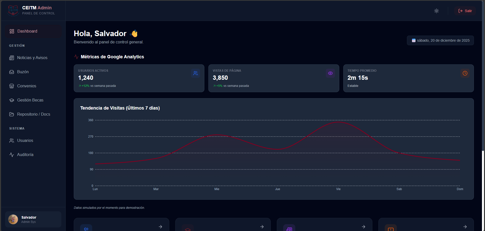
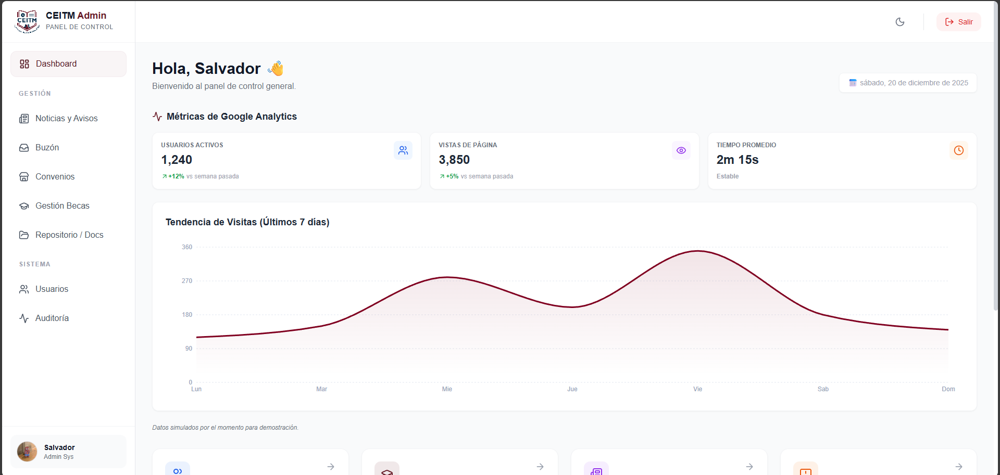
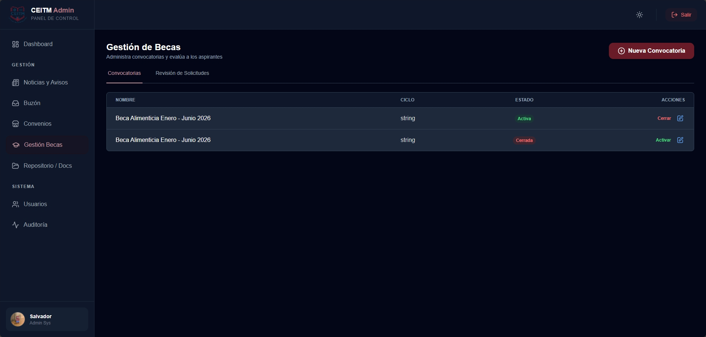
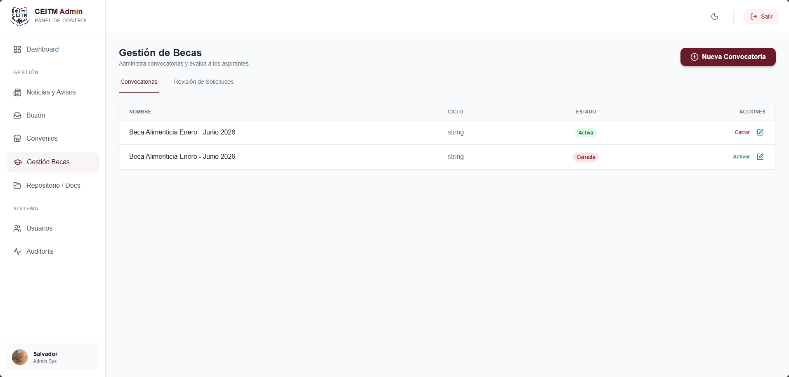
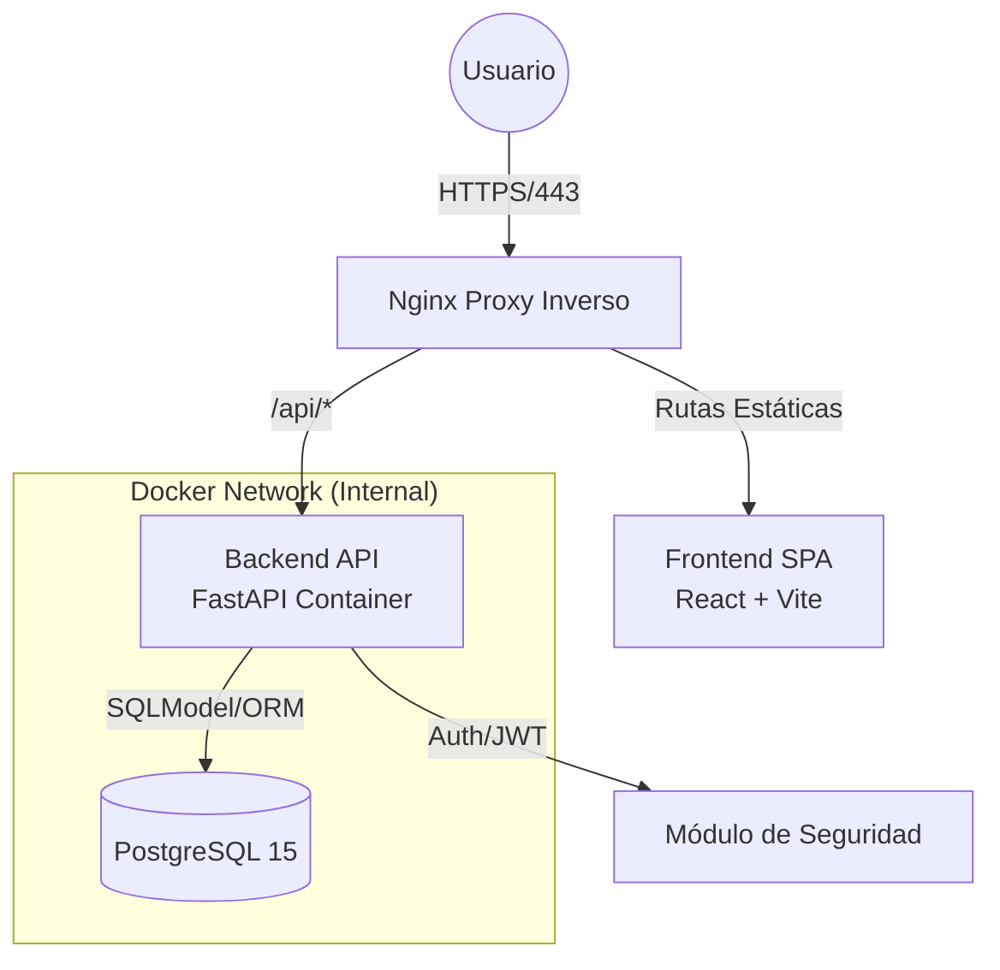

# 🏛️ Plataforma CEITM - Sistema de Gobernanza Digital

<div align="center">


<br/>


</div>

> **Gestión integral, transparente y escalable para el H. Consejo Estudiantil del Instituto Tecnológico de Morelia.**

Esta plataforma implementa una arquitectura moderna de microservicios conteinerizados para digitalizar los procesos críticos del CEITM, incluyendo la gestión de becas, convenios empresariales, geolocalización de espacios (mapa interactivo), auditoría de transparencia y difusión de noticias, en estricto cumplimiento con los **Estatutos Oficiales 2025**.

---

## 📸 Demo de la Interfaz

> Vista del Panel de Administración y Gestión de Becas.






---

## 🏗️ Arquitectura del Sistema

El sistema utiliza el patrón **PERF** (Postgres, Express/FastAPI, React, FastAPI) desacoplado, garantizando alta disponibilidad, separación de responsabilidades y despliegue seguro mediante Proxy Inverso.


```mermaid
graph TD
    User((Usuario)) -->|HTTPS/443| NGINX[Nginx Proxy Inverso]
    
    NGINX -->|Rutas Estáticas| FE[Frontend SPA<br/>React + Vite]
    NGINX -->|/api/*| API[Backend API<br/>FastAPI Container]
    
    subgraph "Docker Network (Internal)"
        API -->|SQLModel/ORM| DB[(PostgreSQL 15)]
    end
    
    API -->|Auth/JWT| Security[Módulo de Seguridad]

```

### Componentes Clave:

1. **Nginx (Gateway):** Maneja SSL, sirve el Frontend estático y enruta las peticiones de API hacia Docker.
2. **Frontend (React):** SPA optimizada con soporte PWA y SEO (Open Graph).
3. **Backend (FastAPI):** Microservicio aislado en Docker, exponiendo solo el puerto interno al Proxy.

---

## 📋 Tabla de Contenidos

* [🏛️ Plataforma CEITM - Sistema de Gobernanza Digital](https://www.google.com/search?q=%23%EF%B8%8F-plataforma-ceitm---sistema-de-gobernanza-digital)
* [🏗️ Arquitectura del Sistema](https://www.google.com/search?q=%23%EF%B8%8F-arquitectura-del-sistema)
* [📋 Tabla de Contenidos](https://www.google.com/search?q=%23-tabla-de-contenidos)
* [🔌 Prerrequisitos del Entorno](https://www.google.com/search?q=%23-prerrequisitos-del-entorno)
* [🚀 Instalación y Despliegue](https://www.google.com/search?q=%23-instalaci%C3%B3n-y-despliegue)
* [1. Clonado y Configuración de Entorno](https://www.google.com/search?q=%231-clonado-y-configuraci%C3%B3n-de-entorno)
* [2. Despliegue con Docker (Backend & DB)](https://www.google.com/search?q=%232-despliegue-con-docker-backend--db)
* [3. Ejecución del Frontend (Desarrollo Local)](https://www.google.com/search?q=%233-ejecuci%C3%B3n-del-frontend-desarrollo-local)


* [🛠️ Stack Tecnológico](https://www.google.com/search?q=%23%EF%B8%8F-stack-tecnol%C3%B3gico)
* [📂 Estructura del Proyecto](https://www.google.com/search?q=%23-estructura-del-proyecto)
* [🔧 Troubleshooting](https://www.google.com/search?q=%23-troubleshooting)
* [🤝 Contribución](https://www.google.com/search?q=%23-contribuci%C3%B3n)


---

## 🔌 Prerrequisitos del Entorno

Para garantizar la ejecución correcta de los contenedores y el entorno de desarrollo local, asegúrese de cumplir con las siguientes dependencias base.

| Componente | Versión Mínima | Motivo Crítico / Nota Técnica |
| --- | --- | --- |
| **Docker Engine** | `24.0+` | Requerido para la orquestación de servicios y volúmenes persistentes. |
| **Docker Compose** | `v2.20+` | Necesario para interpretar la sintaxis `version: '3.8'` del manifiesto. |
| **Node.js** | `v18.17+ (LTS)` | Requerido por el Frontend si se ejecuta fuera de Docker (Vite build target). |
| **Git** | `2.30+` | Control de versiones. |

---

## 🚀 Instalación y Despliegue

### 1. Clonado y Configuración de Entorno

El sistema utiliza variables de entorno para la configuración de seguridad y conexión a base de datos. **Nunca** suba el archivo `.env` al repositorio.

```bash
# 1. Clonar repositorio
git clone <URL_DEL_REPO>
cd ceitm-platform

# 2. Configurar variables de entorno
cp .env.example .env

# 3. (Opcional) Editar credenciales de BD y SECRET_KEY
nano .env

```

### 2. Despliegue con Docker (Backend & DB)

Este comando aprovisiona la base de datos PostgreSQL y el servidor API Uvicorn en una red aislada.

```bash
docker-compose up --build -d

```

> **Verificación:** Ejecute `docker-compose ps` para asegurar que los servicios `db` y `backend` tienen estado `Up`.

### 3. Ejecución del Frontend (Desarrollo Local)

Para habilitar HMR (Hot Module Replacement) y depuración en tiempo real:

```bash
cd frontend

# Instalación limpia de dependencias
npm install

# Iniciar servidor de desarrollo
npm run dev

```

| Servicio | URL Local | Descripción |
| --- | --- | --- |
| **Frontend App** | `http://localhost:5173` | Interfaz de Usuario (Vite Dev Server) |
| **Backend API** | `http://localhost:8000` | API Root |
| **API Docs** | `http://localhost:8000/docs` | Documentación interactiva Swagger UI |
| **Redoc** | `http://localhost:8000/redoc` | Documentación alternativa de API |

---

## 🛠️ Stack Tecnológico

La plataforma está construida sobre tecnologías de "Bleeding Edge" para maximizar rendimiento, SEO y mantenibilidad.

### Frontend (SPA & PWA)

| Tecnología | Propósito |
| --- | --- |
| **React 18** | Biblioteca UI base. |
| **TypeScript** | Tipado estático estricto. |
| **Vite** | Build tool de próxima generación. |
| **Tailwind CSS** | Framework de estilos Utility-first. |
| **Mapbox GL JS** | Mapa interactivo con geofencing y GPS. |
| **Zustand** | Gestión de estado global ligero. |
| **Open Graph** | Optimización SEO para redes sociales (WhatsApp/FB). |

### Backend (REST API)

| Tecnología | Propósito |
| --- | --- |
| **FastAPI** | Framework asíncrono de alto rendimiento. |
| **SQLModel** | ORM (intersección SQLAlchemy + Pydantic). |
| **PostgreSQL 15** | Motor de base de datos relacional. |
| **Python-Jose** | Implementación de tokens JWT. |
| **Uvicorn** | Servidor ASGI de producción. |

---

## 📂 Estructura del Proyecto

Organización modular tipo "Monorepo" para facilitar la escalabilidad horizontal.

```plaintext
/ceitm-platform
├── /backend
│   ├── /app
│   │   ├── /api/v1/endpoints   # Controladores por dominio (becas, noticias, usuarios)
│   │   ├── /core               # Configuración global, Seguridad, DB Connectors
│   │   ├── /models             # Esquemas de Base de Datos (SQLModel)
│   │   └── /schemas            # Esquemas de Validación Pydantic
│   ├── /static/uploads         # Almacenamiento local de archivos (PDFs, Imágenes)
│   └── Dockerfile              # Imagen Python-Slim optimizada
│
├── /frontend
│   ├── /public                 # Assets estáticos (og-image, logos, manifest)
│   ├── /src
│   │   ├── /modules            # Arquitectura orientada a dominios
│   │   │   ├── /admin          # Panel de administración
│   │   │   ├── /map            # Módulo de Mapa Interactivo (Mapbox)
│   │   │   ├── /scholarships   # Sistema de becas
│   │   │   └── /...
│   │   ├── /shared             # Componentes, Hooks y Servicios reutilizables
│   └── index.html              # Entry point con SEO Tags
│
└── docker-compose.yml          # Orquestador de servicios

```

---

## 🔧 Troubleshooting

Soluciones a incidencias comunes durante el despliegue.

| Problema | Solución |
| --- | --- |
| **Port 5432 already allocated** | Detener el servicio local de Postgres (`sudo service postgresql stop`). |
| **CORS Error (Frontend)** | Verificar que `CORSMiddleware` en FastAPI incluya el dominio del frontend. |
| **404 en Service Worker (sw.js)** | Verificar permisos de lectura en `/var/www/ceitm` o carpeta `dist`. |
| **Mapa no carga en móvil** | Asegurar que el sitio se sirva por HTTPS (requerido para GPS). |
| **WhatsApp no muestra imagen** | Usar el Debugger de FB para limpiar caché y verificar etiquetas OG. |

---

### 🤝 Contribución

1. **Branching:** Crear ramas descriptivas (`feat/nuevo-mapa`, `fix/login-bug`).
2. **Commits:** Seguir la convención [Conventional Commits](https://www.conventionalcommits.org/).
3. **Linting:** Ejecutar `npm run lint` antes de PR.

---

> **Mantenido por:** Coordinación de Sistemas del CEITM.
> *Copyright © 2025 - Todos los derechos reservados.*

```